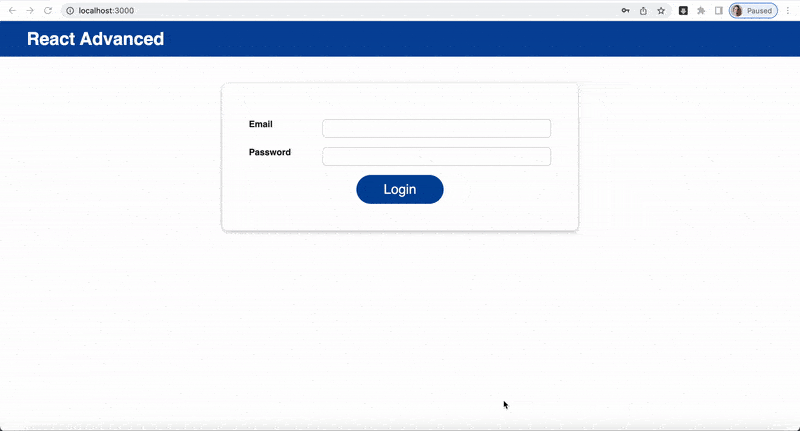

# effects-reducers-context

### About project:

This project was done according to the lectures (91-108) on udemy ["Modern React from zero to pro"](https://www.udemy.com/course/react-np/). 

"effects-reducers-context" is a project on React with login/logout form. 

### Tehnology: 

* HTML
* CSS
* JavaScript
* React
* Git

# Installation
To run on a local machine, you need:

1. Install npm dependencies:
### `npm install`
2. Run in development mode:
### `npm run start`

If everything went right, the project will be launched on [http://localhost:3000](http://localhost:3000)

# Additional programs which I used:

Video to gif was done through [https://ezgif.com/video-to-gif](https://ezgif.com/video-to-gif)

Optimization of images was done through [https://ezgif.com/optimize](https://ezgif.com/optimize)

# Preview

